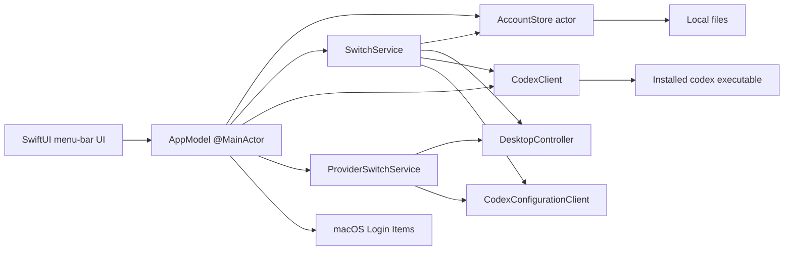
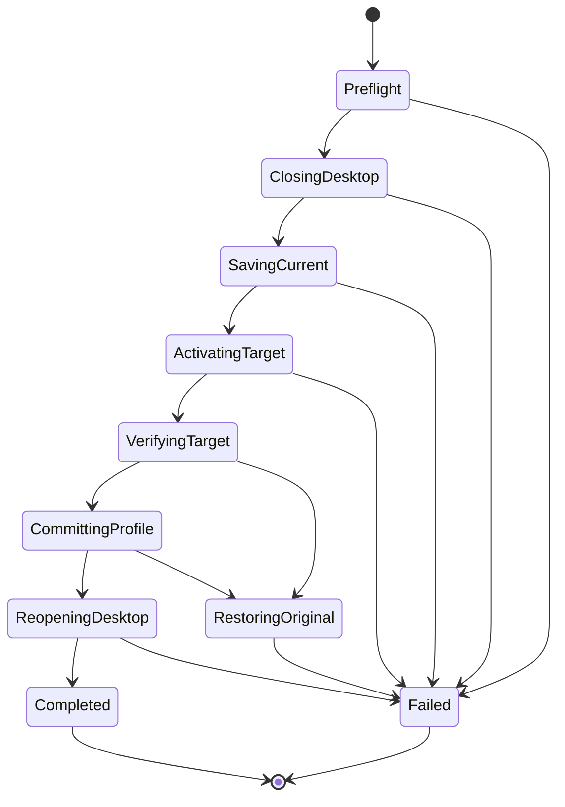
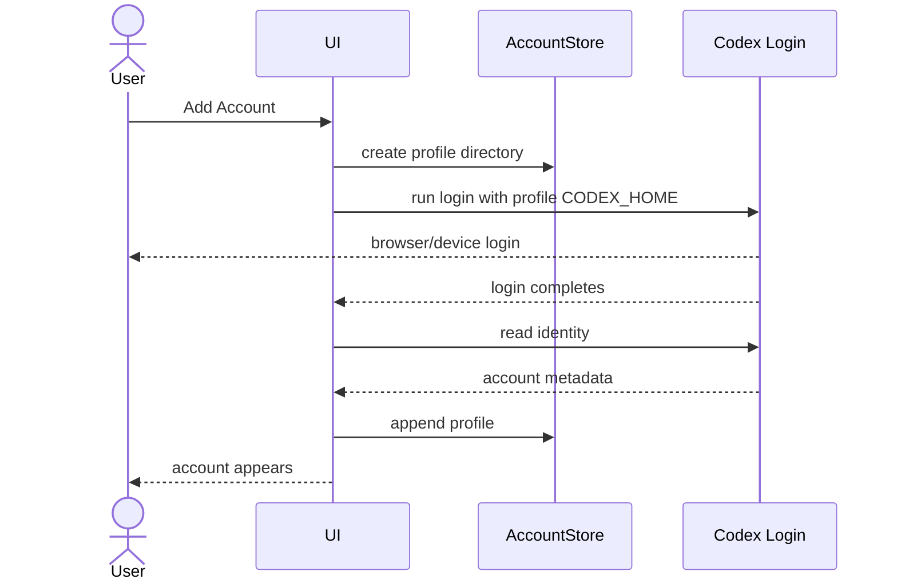

# System design

## 1. Overview

Codex Account Switcher is a native macOS menu-bar application that manages multiple local Codex authentication snapshots and selects custom model providers already configured in Codex.

The system has two core operations:

```text
copy the selected profile's auth.json into ~/.codex/auth.json
set model_provider through the Codex app-server configuration API
```

Everything else exists to make that operation understandable and usable:

- identify saved accounts;
- display weekly Usage and optional 5-hour Usage;
- close and reopen Codex Desktop;
- save the currently active credential before replacing it;
- verify that Codex can read the selected identity;
- maintain a small amount of local metadata;
- list configured providers without reading their environment-variable values;
- restore the built-in OpenAI provider when a saved ChatGPT account is selected.

The MVP uses direct sequential code and lets failures surface. One bounded consistency action restores the validated original profile credential when target verification or the registry commit fails after activation. There is no general rollback framework.

## 2. Design goals

### 2.1 Goals

- one-click account selection after one confirmation;
- one-click configured-provider selection after one confirmation;
- native macOS behavior;
- no modification to Codex Desktop;
- shared Codex configuration and history under `~/.codex`;
- independent saved authentication profiles;
- weekly Usage and optional exact 5-hour Usage for each profile;
- immediate display of persisted Usage while refresh runs;
- explicit, stage-specific errors;
- code small enough to review as an MVP.

### 2.2 Non-goals

- zero-downtime switching;
- a general rollback state machine for arbitrary partial completion;
- automatic repair;
- background daemon;
- cloud synchronization;
- secure enclave or Keychain integration;
- account routing per request;
- concurrent account use inside one Codex process;
- compatibility abstraction for every future Codex authentication backend;
- API-key entry or custom-provider credential storage;
- moving an existing conversation to another provider.

## 3. Platform and technology

Recommended stack:

- macOS 14+;
- Swift 6;
- SwiftUI for UI;
- `MenuBarExtra` for the status item and popover;
- AppKit for process discovery and application lifecycle;
- Service Management for the main app's Login Item registration and authorization state;
- Foundation `FileManager`, `Process`, and JSON coding;
- Codex app-server JSON-RPC over stdio for identity and Usage reads.

No third-party runtime dependency is required beyond the installed Codex executable. A local
package may optionally embed a compatible Codex executable and its `codex-code-mode-host`
companion; Desktop receives that executable through `CODEX_CLI_PATH`.

## 4. High-level architecture



The application is a single process. There is no daemon and no local network service.

## 5. Source layout

```text
Sources/CodexAccountSwitcher/
├── SwitcherApp.swift
├── AppModel.swift
├── MenuBarPopover.swift
├── AccountRow.swift
├── ProviderRow.swift
├── ManageAccountsView.swift
├── SettingsView.swift
├── Models.swift
├── Localization.swift
├── AccountStore.swift
├── CodexClient.swift
├── CodexConfigurationClient.swift
├── WeeklyUsageNormalizer.swift
├── SwitchService.swift
├── ProviderSwitchService.swift
└── DesktopController.swift

Tests/CodexAccountSwitcherTests/
Checks/CoreChecks.swift
```

Avoid adding protocol layers until a second implementation actually exists. Small concrete types are preferable for the MVP.

## 6. Local storage

### 6.1 Paths

```text
~/.codex/
└── auth.json                         # active credential used by Codex

~/Library/Application Support/Codex Account Switcher/
├── accounts.json                     # profile metadata and active account ID
├── settings.json                     # language and Usage display settings
├── usage-cache.json                  # last successful normalized Usage per profile
└── accounts/
    ├── <profile-id>/
    │   └── auth.json                 # saved credential snapshot
    └── <profile-id>/
        └── auth.json
```

Directory permissions:

```text
Codex Account Switcher directory 0700
accounts/<profile-id>                 0700
auth.json                             0600
accounts.json / settings.json         0600
usage-cache.json                      0600
```

The implementation sets these permissions when creating files. It does not build a separate permission-audit or repair subsystem.

### 6.2 `accounts.json`

```json
{
  "activeAccountID": "6FB26BF8-57C2-4DF6-8C2A-B4A5E5E6A915",
  "accounts": [
    {
      "id": "6FB26BF8-57C2-4DF6-8C2A-B4A5E5E6A915",
      "displayName": "Personal",
      "email": "user@example.com",
      "accountID": "acct_123",
      "createdAt": "2026-08-21T06:00:00Z",
      "lastUsedAt": "2026-08-21T06:00:00Z"
    }
  ]
}
```

`accountID` and `email` are metadata returned by Codex when available. The login identity supplies the local display name; the MVP has no rename operation.

### 6.3 `settings.json`

```json
{
  "language": "system",
  "showsMenuBarPercentage": true,
  "showsFiveHourUsage": false
}
```

When `showsFiveHourUsage` is absent from an older file, decoding defaults it to `false`. This preserves the existing compact account-row layout after an upgrade. Setting changes are saved immediately.

Launch-at-login state is owned by macOS Service Management and is read from `SMAppService.mainApp.status`. It is never copied into `settings.json`.

`usage-cache.json` stores `profileID`, normalized weekly Usage, optional 5-hour Usage, and `fetchedAt` for each last successful response. The optional fields allow older weekly-only cache entries to decode. No switch phase, rollback reference, or recovery journal is stored.

### 6.4 Writes

Credential activation uses a temp file and rename in the same directory:

```text
copy target auth bytes to ~/.codex/auth.json.switcher-<uuid>.tmp
→ chmod 0600
→ rename the temporary file to auth.json
```

This is used only to prevent a partially written JSON file. It is not a rollback mechanism.

Metadata can use the same small `write temp → rename` helper. There is no history file and no previous-version retention.

## 7. Domain model

### 7.1 `AccountProfile`

```swift
struct AccountProfile: Codable, Identifiable, Equatable {
    let id: UUID
    var displayName: String
    let email: String?
    let accountID: String?
    let createdAt: Date
    var lastUsedAt: Date?
}
```

### 7.2 `WeeklyUsage`

```swift
struct WeeklyUsage: Codable, Equatable {
    let remainingPercent: Int
    let resetsAt: Date
    let fiveHourRemainingPercent: Int?
    let fiveHourResetsAt: Date?
}
```

The normalizer clamps values:

```swift
remainingPercent = min(100, max(0, round(100 - usedPercent)))
```

### 7.3 Usage cache and view state

```swift
struct UsageCacheEntry: Codable, Equatable {
    let profileID: UUID
    let usage: WeeklyUsage
    let fetchedAt: Date
}

enum UsageViewState: Equatable {
    case idle
    case loaded(WeeklyUsage)
    case stale(WeeklyUsage, String)
    case unavailable(String)
}
```

### 7.4 `SwitchStage`

```swift
enum SwitchStage: String {
    case closeDesktop
    case saveCurrentCredential
    case activateTargetCredential
    case activateTargetProvider
    case verifyTargetIdentity
    case commitActiveAccountID
    case reopenDesktop
}
```

The stage is held in memory only for progress and error messages.

## 8. Codex executable discovery

`CodexExecutableLocator` resolves the executable for each requested operation.

Lookup order:

1. test-only explicit URL;
2. the login shell's shared `CODEX_CLI_PATH`, resolved through its `PATH` when it is a command name;
3. the login shell's `codex` command when no shared override is set.

The normal runtime version is never pinned. Each operation resolves the current system command. A
local package with an embedded backend is the explicit exception: Desktop receives that backend
through `CODEX_CLI_PATH`, and packaging requires its sibling `codex-code-mode-host`. The same
login-shell PATH is passed to app-server so npm launchers can resolve Node. A missing command or
invalid explicit path is an error.

If not found, show one direct error:

```text
Codex CLI was not found. Install Codex and reopen Account Switcher.
```

Do not add download automation or multiple package-manager fallbacks in the MVP.

## 9. Codex app-server client

### 9.1 Process

For a given profile home:

```text
CODEX_HOME=<profile-home> codex app-server --stdio
```

The client communicates with newline-delimited JSON-RPC messages over stdin/stdout.

Basic handshake:

```json
{"method":"initialize","id":1,"params":{"clientInfo":{"name":"codex_account_switcher","title":"Codex Account Switcher","version":"0.1.7"}}}
{"method":"initialized","params":{}}
```

The exact notification envelope should follow the installed Codex schema. Generate or inspect the app-server schema during implementation rather than duplicating unrelated protocol types.

### 9.2 Identity read

Use the account-read RPC exposed by the installed Codex version. Normalize the response to:

```swift
struct CodexIdentity {
    let email: String?
    let accountID: String?
    let plan: String?
}
```

Identity matching rule for the MVP:

1. compare `accountID` when both sides have it;
2. otherwise compare normalized email;
3. if neither is available, verification fails.

There is no fallback to local display name or file hash.

### 9.3 Usage read

Call `account/rateLimits/read`. Select `rateLimitsByLimitId["codex"]` when present, otherwise the legacy `rateLimits`. Normalize only that bucket’s `primary` and `secondary`; never merge other metered products:

```text
fiveHour = first window where windowDurationMins == 300
weekly = longest window where 8640 <= windowDurationMins <= 11520
```

The client intentionally ignores:

- any short-duration window other than exactly 300 minutes;
- reset-credit details;
- windows outside six through eight days.

Normalized output:

```swift
WeeklyUsage(
    remainingPercent: clamp(round(100 - weekly.usedPercent), 0, 100),
    resetsAt: weekly.resetsAt,
    fiveHourRemainingPercent: fiveHour.map { clamp(round(100 - $0.usedPercent), 0, 100) },
    fiveHourResetsAt: fiveHour?.resetsAt
)
```

If no six-to-eight-day window exists, return `weeklyUsageUnavailable`. Missing 5-hour data leaves the optional fields empty. A 4-hour or 6-hour window never populates them. The client makes one `account/rateLimits/read` request and parses both windows from the same response whether the display setting is on or off.

### 9.4 Provider configuration

`CodexConfigurationClient` calls `config/read` to obtain the active `model_provider` and configured `model_providers`. It retains only provider identifiers and display names for the UI. Selecting a provider calls `config/value/write` with `keyPath = "model_provider"`, then reads the configuration again to verify the result.

The switcher does not persist provider definitions or custom-provider secrets. Environment variables, command-backed authentication, and other provider-specific credential mechanisms remain owned by Codex and the user's existing configuration.

`config/read` returns full effective configuration. Inline credentials can enter the switcher process in the decoded response. Only provider IDs/names are retained for the UI; this is not a claim that secrets never enter memory. Configuration reads also occur during account selection, even with the advanced provider UI disabled. The switcher does not display, log, or persist inline provider credentials.

Provider selection is off by default, including when migrating older settings. Both provider rows and the AppModel switching action require opt-in. Disabling the setting does not modify Codex configuration. Model selection/catalog handling is outside this feature; see [compatibility and acceptance](provider-compatibility.md).

Conversation provider identity is persisted by Codex. The switcher does not edit Codex's thread database or rollout files, so provider selection applies to new conversations and does not mutate existing conversations.

### 9.5 Timeouts

Use one fixed 20-second process/request timeout. Login completion has a separate 10-minute timeout. On timeout:

- terminate the app-server child;
- return a timeout error;
- do not retry.

This prevents a blocked row refresh from hanging indefinitely without creating a retry framework.

## 10. Usage service

### 10.1 Profile-specific `CODEX_HOME`

Each account directory acts as a minimal Codex home for identity and Usage calls:

```text
~/Library/Application Support/Codex Account Switcher/accounts/<profile-id>/auth.json
```

The switcher starts app-server with `CODEX_HOME` set to that directory. This lets it read Usage without changing the active `~/.codex/auth.json`.

### 10.2 Refresh behavior

At application launch, when the pending five-minute timer fires, and whenever the popover opens:

1. load account metadata and persisted weekly and optional 5-hour Usage;
2. render cached values immediately without replacing them with a loading state;
3. refresh all accounts concurrently;
4. replace the pending timer with one scheduled five minutes after the latest trigger;
5. share one active refresh task when launch, timer, and popover triggers overlap;
6. publish and persist each successful result as it completes;
7. retain cached Usage with a warning on failure, or show unavailable when no cache exists.

The app owns one pending timer while it runs. Every launch, timer, or popover trigger cancels the previous timer and schedules the next deadline five minutes later. The timer remains active while the popover is closed. There is no helper daemon, exponential backoff, or silent retry.

### 10.3 Persisting refreshed credentials

Codex may refresh the profile's token while app-server runs. Because that app-server uses the profile directory directly, any updated `auth.json` remains in the correct profile directory. No extra copy-back stage is required.

## 11. Desktop controller

`CodexDesktopController` has two operations:

```swift
func close() async throws
func open() async throws
```

### 11.1 Close

Use `NSRunningApplication` for the Codex Desktop bundle identifier and call `terminate()`.

Codex Desktop can display a quit confirmation while work is active. Allow up to 30 seconds for its normal exit, including its history and settings flush. Never force-terminate Desktop. If the quit request is rejected or Desktop remains running, report a close-stage error before saving or replacing credentials. The user can finish or stop active tasks, close Desktop, and switch again. Cancellation also stops the wait.

The switcher only observes the Desktop application's exit; it does not terminate CLI processes or claim to repair Codex's history database. Account RPCs read the login shell's `PATH` and shared `CODEX_CLI_PATH` setting. A bare command such as `codex` resolves through that PATH; an explicit absolute path must be executable. The child receives the same PATH so npm launchers can find Node. There is no switcher-specific override or automatic selection of another bundled CLI.

If Desktop is not running, `close()` succeeds immediately.

### 11.2 Open

Use `NSWorkspace.shared.openApplication` with the installed Codex application URL.
When the app bundle contains an optional backend, pass its path as `CODEX_CLI_PATH` and require the
adjacent `codex-code-mode-host` before opening Desktop. This keeps the local Azure-tested backend
together without modifying the installed ChatGPT application.

If launch fails, return the AppKit error. The account switch remains at whatever stage already completed; no automatic account restoration occurs.

### 11.3 CLI processes

The switcher never enumerates, terminates, signals, or restarts `codex` CLI processes.

An existing CLI process may have already loaded credentials into memory. Therefore:

- existing CLI processes continue independently;
- a new CLI process reads the newly active `~/.codex/auth.json`.

## 12. Direct switch sequence

### 12.1 State diagram



`RestoringOriginal` is the single bounded consistency action after successful target activation and before a successful registry commit. There is no persisted or general rollback state machine.

### 12.2 Pseudocode

```swift
func switchAccount(to targetID: UUID) async throws {
    let target = try store.profile(id: targetID)
    let registry = try store.loadRegistry()
    guard let originalActiveID = registry.activeAccountID,
          registry.accounts.contains(where: { $0.id == originalActiveID }) else {
        throw AccountStoreError.activeProfileMissing
    }

    stage = .closeDesktop
    try await desktop.closeDesktop()

    stage = .saveCurrentCredential
    try await store.saveCurrentCredential()

    stage = .activateTargetCredential
    try await store.activateTargetCredential(id: target.id)

    stage = .verifyTargetIdentity
    do {
        let identity = try await codex.readIdentity(profileHome: store.activeCodexHome())
        guard identity.matches(target) else { throw CodexClientError.identityUnavailable }
    } catch {
        throw await restoreOriginalCredential(originalActiveID, preserving: error)
    }

    stage = .commitActiveAccountID
    do {
        try await store.commitActiveAccountID(target.id)
    } catch {
        throw await restoreOriginalCredential(originalActiveID, preserving: error)
    }

    stage = .reopenDesktop
    try await desktop.reopenDesktop()
}
```

The restoration helper reuses the saved profile credential and the same atomic installation path. It returns the original stage error after a successful restoration, or one error containing both the original and restoration failures.

### 12.3 Preflight

Preflight performs only the minimum required to start:

- target profile exists;
- when `originalActiveID` exists, it refers to a registry profile before credential writes; with no active ID, the shared auth file must also be absent;
- no in-process switch is currently running.

It does not inspect every filesystem property, create backups, test network reachability, or pre-verify credentials.

These checks occur before the six recorded `SwitchStage` values.

### 12.4 Close Codex Desktop

Closing Desktop comes before saving the active credential so Codex has a chance to finish its normal shutdown writes.

### 12.5 Save current credentials

The registry must identify one active account. After Desktop exits, read the shared home’s current identity and match it against this profile before saving. An external login mismatch stops visibly and leaves saved profiles unchanged.

```text
copy ~/.codex/auth.json
→ accounts/<activeAccountID>/auth.json.switcher-<uuid>.tmp
→ rename to accounts/<activeAccountID>/auth.json
```

If the active file is missing or unreadable, stop and show the error. Do not continue by assuming the stored snapshot is good enough.

### 12.6 Activate target

```text
copy accounts/<targetID>/auth.json
→ ~/.codex/auth.json.switcher-<uuid>.tmp
→ chmod 0600
→ rename the temporary file to ~/.codex/auth.json
```

If activation fails, stop. Atomic installation throws before a completed replacement, so no restoration runs. There is no credential backup file.

### 12.7 Verify target

Start Codex app-server using the active `~/.codex` home and read identity.

If identity does not match the target metadata, preserve the mismatch as the stage error and reinstall the just-saved original profile credential into `~/.codex/auth.json`.

### 12.8 Commit active profile

After successful identity verification, write `activeAccountID` and `lastUsedAt` to `accounts.json`.

If this write fails, preserve the registry error and reinstall the just-saved original profile credential. The registry continues to name the original profile. No retry or startup reconciliation runs.

### 12.9 Reopen Desktop

Always attempt to reopen Codex Desktop after metadata commit.

If opening fails, report `reopeningDesktop` failure. The selected account remains active.

## 13. Failure behavior

### 13.1 Error model

```swift
struct SwitchFailure: LocalizedError {
    let stage: SwitchStage
    let underlying: Error
}
```

Example presentation:

```text
Could not verify selected account.

Stage: Verifying selected account
Error: Codex returned user@example.com, expected work@example.com.
```

After a successful restoration, keep this original verification error visible. Do not replace it with a success-style message such as:

```text
Something went wrong, but everything is fine now.
```

If restoration also fails, append that failure to the original message and retain both underlying diagnostic descriptions.

### 13.2 No hidden recovery

The following are intentionally absent:

- restoration outside the documented verification/commit failure window;
- a general rollback state machine;
- credential backup files;
- retry with another profile;
- retry with cached identity;
- alternate rate-limit window;
- startup journal replay;
- delayed cleanup queue;
- periodic consistency checker.

### 13.3 Manual resolution

The user can resolve a failed state by performing another explicit action:

- select the desired account again;
- add or re-login the profile again;
- open Codex Desktop manually;
- inspect the reported path or Codex error.

Manual resolution is not triggered automatically by the app.

## 14. Add-account flow

### 14.1 Sequence



### 14.2 Details

1. Generate a profile UUID.
2. Create `accounts/<uuid>/`.
3. Run Codex login with `CODEX_HOME` set to that directory.
4. Wait for login completion.
5. Read identity from the same profile home.
6. Derive the local display name from the returned identity.
7. Append profile metadata.
8. Return to Manage Accounts.

If any step fails, stop and show the error. Remove this login attempt’s directory only while it remains unregistered. Preserve the original error; surface cleanup failure too. Cancellation stops the login session and performs the same cleanup.

## 15. Remove-account flow

1. Reject the active or an unknown profile.
2. Remove its cached Usage if present.
3. Persist the account list without the removed profile.
4. Delete the profile directory.
5. If directory deletion fails, restore the original account list and report the original error. Report both errors if list restoration also fails.

A registry-write failure leaves the credential directory intact. The bounded list restoration covers the demonstrated deletion failure; it does not make recursive deletion crash-atomic or restore a partially deleted directory. No tombstone, retry queue, journal, or credential copy is introduced.

## 16. UI state management

`AppModel` is `@MainActor` and owns:

```swift
@Published private(set) var accounts: [AccountProfile] = []
@Published private(set) var activeAccountID: UUID?
@Published private(set) var usageStates: [UUID: UsageViewState] = [:]
@Published private(set) var settings: AppSettings = .default
@Published private(set) var launchAtLoginState: LaunchAtLoginState = .disabled
@Published private(set) var isMutating = false
@Published private(set) var isAddingAccount = false
@Published var visibleError: OperationError?
```

Only one mutation runs at a time. While `isMutating` is true:

- account rows are disabled;
- Manage Accounts actions that mutate profiles are disabled;
- Quit remains available.

This is a simple in-process UI invariant, not a cross-process lock service.

Browser sign-in uses `isAddingAccount` and a separately retained task. It does not hold the mutation lock while waiting for the browser callback. Manage Accounts replaces Add Account with a cancel action during this wait; canceling terminates the app-server session and restores the normal button without showing an error.

`MenuBarPopover` owns an in-memory page enum for the account list, Manage Accounts, Settings, and switch confirmation. All secondary pages render inside the same 326-point popover. Cancel and Back change only page state. The root view resets the page to the account list on every popover appearance.

## 17. Localization

Use string catalogs for:

- account actions;
- confirmation copy;
- progress stages;
- Usage unavailable state;
- reset formatting labels;
- errors produced by switcher-owned validation.

System errors may retain English technical details underneath a localized summary.

Language preference values:

```swift
enum AppLanguage: String, Codable {
    case system
    case english
    case simplifiedChinese
}
```

## 18. Observability

The current MVP surfaces operation failures directly in the popover and retains the underlying diagnostic description in memory. It does not log auth file contents or access tokens.

There is no remote telemetry, support bundle, analytics pipeline, or automatic diagnostics upload.

## 19. Compatibility assumptions

The implementation assumes:

- Codex stores active file credentials under `CODEX_HOME/auth.json` when file credential storage is used;
- the installed Codex app-server exposes account identity and rate-limit RPCs;
- 5-hour Codex windows report exactly 300 minutes when available;
- weekly Codex windows report a duration between six and eight days;
- Codex Desktop reads the active `~/.codex` authentication state when launched.

These assumptions should be checked against the Codex version used during implementation. The MVP does not add a compatibility adapter matrix. Unsupported versions fail with a direct message.

## 20. What must not be added during MVP

Do not add the following unless a new product decision explicitly requires it:

- rollback copy;
- transaction journal;
- crash recovery coordinator;
- retry policy;
- failover;
- Keychain abstraction;
- SQLite;
- daemon;
- helper process that stays resident;
- Usage details panel;
- switch-behavior settings;
- CLI process control;
- automatic account selection.

## 20. v0.1.7 lifecycle completion

First activation skips saving an original credential when both active ID and shared auth are absent; recheck file absence after Desktop closes. If verification or commit fails, clear only the newly installed active auth and preserve the saved target profile. Normal switches retain the existing original-credential restoration path.

AccountStore rejects duplicate identities on add. Register Current Account explicitly associates the shared login with a matching saved profile or imports a new one. Login cleanup checks the registry before deleting the attempt directory. The updater uses the semantic release version as CFBundleVersion, eliminating a separately maintained build number.
